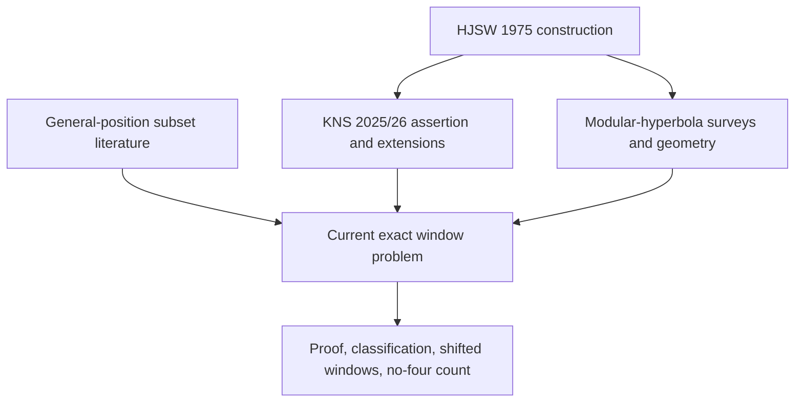
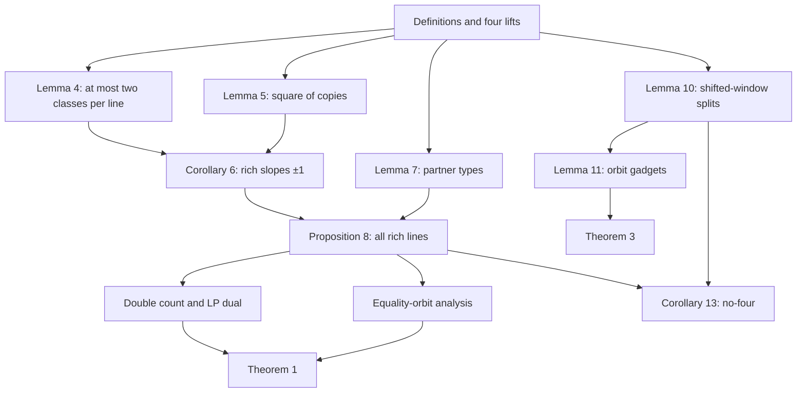

> **Note:** external LLM-assisted audit (ChatGPT deep research with sub-agents, commissioned by the author of record) of draft v0.5 of `paper/hjsw_window.tex`, received 2026-08-18.  Not a human referee report.  The revision v0.6 addresses its items (see `docs/THREAD.md` [50]).

# Deep Research Report on *Extremal no-three-in-line subsets of a modular hyperbola in the Hall–Jackson–Sudbery–Wild window*

**Manuscript audited:** `hjsw_window_v0.5.pdf`, August 2026, 12 pages  
**Research date:** 18 August 2026  
**Report language:** English  
**Overall verdict:** **Go after major revision; reframe as a focused short note**

## 1. Executive summary

The manuscript contains a mathematically valuable exact structural result, and its central theorem appears correct. The cleanest contribution is not the bare value $3(p-1)$: Kovács–Nagy–Szabó had already described the HJSW deletion as optimal, at least as an assertion, before this draft. The defensible contribution is the first apparently complete proof of that optimum, together with the rich-line inventory, equality classification, $9^s$ count, uniqueness criterion, objective-specific LP certificate, arbitrary-window formula, and exact no-four analogue.

The proof audit found no counterexample to Theorem 1 or Corollary 13. Their central arguments are analytic and do not logically depend on computation. Theorem 3 is also strongly corroborated, including every local optimum and multiplicity, but it is not fully self-contained as written. In Lemma 11, the proposed construction for a generic orbit of type $(1,1)$ is incorrect or seriously ambiguous, and the essential multiplicity 144 is replaced by an unexplained “direct enumeration.” A short analytic count repairs the gap; the numerical result itself is not false.

Independent clean-room programs found no finite counterexample. They reconstructed all Euclidean rich lines from point pairs rather than assuming the manuscript’s slope or orbit classification. The checks covered all $c$ for every odd prime through 31 in the HJSW window, thousands of shifted boxes through $p=13$, further deterministic samples through $p=31$, and solver spot checks for the larger-window and two-hyperbola tables. Edge cases $p=3,5$ pass. This is strong corroboration, not a substitute for proof.

The current reproducibility package has a major release-engineering error. The uploaded PDF has SHA-256 `4b898706…9ddd` and matches the PDF currently on repository `main` at commit `70de92c…`, but the public tag `paper-v0.5` peels to commit `e08d43b…`, whose TeX identifies itself as draft v0.1 and does not contain the v0.5 arbitrary-window results. The cited commit `d422b78…` exists, but it contains only an early checker and project correspondence, not a versioned v0.5 research compendium. The repository also lacks a locked environment and complete solver certificates.

The priority search did not locate an earlier proof of the full package. However, it did confirm a material priority qualification: the arXiv v1 of Kovács–Nagy–Szabó, posted 11 August 2025, already characterized the HJSW $S_2$ choice as optimal, and the current v2 similarly calls $S_2$ and $S_3$ largest within the single-hyperbola construction. The manuscript must therefore claim a proof, classification, and strengthening of an existing assertion—not discovery of the optimum value.

The present AI disclosure is transparent but creates a serious submission risk. It says that an autonomous model produced the theorem, proof, program, and text, while the human author posed and organized the question. That description is difficult to reconcile with the current [Australasian Journal of Combinatorics AI policy](https://ajc.maths.uq.edu.au/?page=author_guidelines), which requires the direction and mathematical substance to be author-driven and rejects simple delegation of mathematical work. It is also risky under [Elsevier’s June 2026 policy](https://www.elsevier.com/about/policies-and-standards/generative-ai-policies-for-journals), which permits limited supportive use but treats generated manuscript sections without genuine author intellectual contribution as inappropriate. The [Electronic Journal of Combinatorics policy](https://www.combinatorics.org/ojs/index.php/eljc/about) is more compatible, but only after the human author personally checks every proof and detail and the paper becomes human-checkable.

Submission of v0.5 as it stands is not recommended. After repairing Lemma 11, correcting the priority framing and repository tag, expanding the bibliography, documenting a genuine human proof audit, and moving Section 6 to a clearly labeled computational appendix or companion note, a focused submission to *Discrete Mathematics*, *Graphs and Combinatorics*, or possibly *Electronic Journal of Combinatorics* is reasonable. The current result is below the likely scale threshold of *Journal of Combinatorial Theory, Series A* and *Advances in Combinatorics* unless it is generalized into a reusable orbit/hypergraph theorem.

## 2. Scope, method, and limits

### 2.1 Materials examined

- The complete research plan supplied with the task.
- The 12-page manuscript PDF, including theorems, computational tables, disclosure, and bibliography.
- The public Git repository, current `main`, the `paper-v0.5` tag, the cited commit `d422b78`, verification scripts, and committed logs.
- HJSW (1975), Kovács–Nagy–Szabó (arXiv v1/v2 and journal metadata), modular-hyperbola surveys and geometric papers, general-position subset literature, closely related no-three-in-line variants, journal scopes, and current AI policies.

### 2.2 Multi-agent research design

The work was organized as sequential parallel waves because the execution environment allowed only three sub-agents at a time. At least five independent full-manuscript referees were assigned to **each** of the four stages—proof, novelty/priority, computation/reproducibility, and publication/editorial assessment. Additional specialists separately audited proof, novelty, and computation/publication. All requested full-stage agents used `gpt-5.6-sol` with `xhigh` reasoning. The lead synthesis then reconciled their claims against primary sources, clean-room calculations, and the manuscript.

Agent consensus is not treated as mathematical evidence. It is reported only where it helped expose a checkable issue, formulate an independent test, or identify a source.

### 2.3 Evidence hierarchy

This report uses the following labels:

| Label | Meaning |
|---|---|
| **Proved** | A self-contained analytic derivation in the manuscript survived line-by-line audit. |
| **Proved after a local repair** | The theorem is supported, but a specific missing or malformed passage must be replaced. |
| **Computation-assisted** | A stated exact fact is supported by exhaustive search or optimization but is not fully derived in the text. |
| **Experimental** | Finite solver data are credible but do not establish a general theorem. |
| **Heuristic** | A pattern or mechanism is suggested, without a complete inference or certificate. |
| **Open** | Explicitly conjectural or unresolved. |

### 2.4 Search limitations

The search used public web indexes, arXiv, Crossref/DOI metadata, publisher pages, accessible citation lists, formula fingerprints, and multilingual web queries. It did **not** have authenticated full-text access to MathSciNet, zbMATH reviews, Scopus, Web of Science, CNKI, Wanfang, VIP, eLIBRARY, RISS, or DBpia. It did not search private correspondence, unpublished manuscripts, or non-indexed theses exhaustively.

No external experts were contacted: doing so would have required sending messages outside the scope of a read-and-report request. The expert-consultation stage in the research plan therefore remains an action item, not completed evidence. In particular, the authors of Kovács–Nagy–Szabó should be asked whether they know an unpublished proof of the asserted optimum or of the equality classification.

Negative search results mean “not found in the stated search,” not “proved absent from the literature.”

### 2.5 Reconciliation of independent referee passes

All five full four-stage referees completed their reviews. Their outputs were produced independently and reconciled only afterward.

| Question | Five-referee result | Specialist cross-check |
|---|---|---|
| Is Theorem 1 mathematically sound? | **5/5 yes** | Proof specialist agreed; no counterexample in clean-room tests |
| Is the LP claim valid? | **5/5 yes**, as equality of optimum values, not general polyhedral integrality | Independent LP solves agreed |
| Is Theorem 3’s numerical formula correct? | **5/5 yes with high confidence** | Proof and computation specialists agreed |
| Is Theorem 3 fully proved as written? | **5/5 no** | All identified the missing 144 derivation; four explicitly flagged the malformed 10-point construction sentence |
| Is the bare optimum value new? | **5/5 no as a public claim** | Novelty specialist confirmed KNS’s earlier assertion |
| Is the classification/arbitrary-window package likely new? | **5/5 likely yes, with search limitations** | Multilingual/formula specialist found no predecessor |
| Is v0.5 reproducible from its cited tag/commit? | **5/5 no** | Direct Git inspection confirmed the mismatch |
| Submission recommendation | **5/5 major revision / focused note** | All specialists agreed |

No material dissent remained after reconciliation. Probability ranges differed, as expected, and the report uses conservative overlapping ranges rather than selecting the most favorable estimate.

## 3. Claim–evidence matrix

| Manuscript claim | Status after audit | Principal evidence | Required action |
|---|---|---|---|
| $\lvert P\rvert=4(p-1)$ in a $2p\times2p$ window | **Proved** | Each nonzero hyperbola class has two representatives in each coordinate interval | None |
| Every rich line has slope $\pm1$ | **Proved** | Lemmas 4–5 and Corollary 6; clean-room all-slope enumeration | None |
| Rich-line counts: $p-1$ triples and $\frac{1}{2}(p-1)-s$ quadruples | **Proved** | Proposition 8; symbolic and computational cross-check | None |
| $\lvert\mathcal L\rvert=\frac{3}{2}(p-1)-s$, $Z=2s$ | **Proved** | Proposition 8 incidence classification | None |
| Maximum lawful subset in the HJSW window is $3(p-1)$ | **Proved** as an upper bound; attainment imported | Double count $Z+2\lvert\mathcal L\rvert$; HJSW construction | Include a short lawfulness proof if claiming full self-containment |
| Fractional LP optimum is $3(p-1)$ | **Proved** | Explicit feasible dual cover plus integral HJSW solution | Say “objective value is integral,” not “the polytope is integral” |
| Number of maxima is $9^s$ | **Proved** | Equality conditions and generic/exceptional orbit decomposition | None |
| Uniqueness iff $p\equiv1\pmod4$ and $c$ is a nonresidue | **Proved** | Quadratic-character interpretation of $s=0$ | None |
| Generic arbitrary-window orbit has split total 0 or 2 | **Proved, dense presentation** | Lemma 10 case analysis; thousands of independent box checks | Rewrite as a transparent Boolean/threshold lemma |
| Lemma 11 local optima and counts | **Proved after local repair / computation-assisted as written** | Independent exhaustive enumeration; analytic repair for 144 | Correct the $(1,1)$ construction and derive 144 |
| Theorem 3 formula $12a+10b+8c+6s$ and multiplicity | **Conditionally proved** | Follows from Lemmas 10–11 and orbit independence | Complete Lemma 11; rename the orbit-count variable $c$ |
| Equality $3(p-1)$ occurs iff $b=c=0$ | **Conditionally proved** | Immediate from gadget values after Lemma 11 repair | Same repair and notation cleanup |
| Four-point rich lines are pairwise disjoint | **Proved** | Slope and copy-parity argument | None |
| No-four optimum $4(p-1)-N_{\mathrm{sh}}$, count $4^{N_{\mathrm{sh}}}$ | **Proved** | Delete one point independently from each disjoint four-line | Define $N_{\mathrm{sh}}$ formally at first use |
| HJSW no-four value $\frac{7}{2}(p-1)+s$ | **Proved** | Minimum number of shared pairs plus HJSW equality | None |
| Larger-window exact tables | **Experimental exact-solver claims** | HiGHS MIP logs; independent zero-gap reruns | Archive environment, models, bounds, gaps, and witnesses |
| Two-/three-hyperbola finite values | **Experimental** | Mixed MIP/SAT/CP-SAT/local-search records | State method per row; do not imply four-method confirmation of every row |
| Gain is $O(1)$ or $o(p)$ | **Open** | Small data only | Keep explicitly conjectural; data do not exclude $\log p$ or $p^\alpha$ |
| Blocking-pair requirement grows like $\log p$ | **Heuristic** | Empirical observations | Define statistic and report uncertainty |
| $\Theta(p^2)$ cross-rich lines and $N\log N$ triple growth | **Unsupported/heuristic** | No proof or adequate regression supplied | Prove, quantify empirically, or remove |

## 4. Scientific value

### 4.1 Scores

| Dimension | Score (1–5) | Assessment |
|---|---:|---|
| Historical importance of the underlying problem | **4.0** | The no-three-in-line problem is classical; HJSW remains central to the best general asymptotic construction for (k=2). A 2026 paper still describes the HJSW modular-hyperbola lower bound as the best known general construction ([Ghosal](https://arxiv.org/abs/2607.05255)). |
| Strength of the exact results | **4.0** | Exact optimum, equality classification, counting, LP certificate, every shifted $2p\times2p$ window, and a no-four analogue form a coherent package. |
| Generality | **2.0** | The theorem is restricted to one modular hyperbola and windows with exactly four lifts per residue class. It does not improve the global no-three-in-line bound. |
| Conceptual novelty | **3.0** | The orbit/gadget viewpoint is elegant and effective here, but the involutions and slope-pair geometry arise naturally from earlier modular-hyperbola work. |
| Transfer potential | **2.5** | The constant-size orbit decomposition suggests an algorithmic template, yet Section 6 shows that multiple curves and larger windows create cross-orbit rich lines and break the simple structure. |
| Likely field impact in current form | **2.5** | Specialists will value the exact closure and classification; the audience is narrower than that of a global asymptotic advance. |

**Composite assessment:** approximately **3.0/5 — solid specialist contribution, not presently a top-tier general advance.**

### 4.2 What the paper does and does not settle

It settles the optimization problem **inside one specified modular hyperbola and one four-lift window family**. It does not show that the HJSW lower bound is globally optimal in the $2p\times2p$ grid, improve the asymptotic coefficient $3/2$, or control unions of hyperbolae. The best framing is therefore “exact local structure of a historically important construction,” not “progress on the global extremal value” without qualification.

### 4.3 Conceptual method

The most useful structural observation is that, for a single curve in a $2p\times2p$ box, the collinearity hypergraph decomposes into constant-size components indexed by orbits of

\[
V=\langle\sigma,\tau\rangle\cong C_2\times C_2.
\]

Once the rich lines are classified, maximum selection and maximum counting become a product of small gadget calculations. Algorithmically, this yields an $O(p)$-scale optimization/counting procedure after class construction; generic GPSS is NP-hard and APX-hard ([Froese–Kanj–Nichterlein–Niedermeier](https://arxiv.org/abs/1508.01097)). This contrast is worth stating as an explicit corollary.

The LP statement is also valuable but narrow: the displayed dual certifies the optimum of this objective for this instance family. It does not prove total unimodularity or integrality of the full feasible polytope.

## 5. Novelty and priority

### 5.1 Priority conclusion

The search supports the following defensible claim:

> The manuscript likely gives the first complete proof and classification of a single-HJSW-window optimum that Kovács–Nagy–Szabó had already asserted, and it adds apparently new exact shifted-window and counting results.

The chronology matters. The [Kovács–Nagy–Szabó arXiv record](https://arxiv.org/abs/2508.07632) shows v1 on 11 August 2025 and v2 on 21 July 2026. The current record says the journal publication is scheduled for 18 September 2026, although it already carries the reference *Advances in Combinatorics* 2026:7 and DOI [10.19086/aic.2026.7](https://doi.org/10.19086/aic.2026.7). As of this report date, the bibliography should say “to appear” or give the arXiv version and accepted journal reference consistently.

The original HJSW source is [Hall–Jackson–Sudbery–Wild, JCTA 18 (1975), 336–341](https://doi.org/10.1016/0097-3165(75)90043-6). It gives the construction and the $3(p-1)$ lawful set. It does not give the present maximum-subset classification.

### 5.2 Component-level novelty assessment

These probabilities estimate whether a mathematically equivalent earlier result exists, conditional on the public search performed. They are deliberately ranges, not pseudo-precise facts.

| Component | Best classification | Probability it is genuinely new | Comment |
|---|---|---:|---|
| Bare optimum value $3(p-1)$ inside one HJSW hyperbola | Prior assertion / proof completion | **2–10%** | KNS already says the deletion is optimal. |
| First complete proof of that optimum | New proof of known/claimed result | **75–90%** | No earlier proof was found; expert confirmation is still needed. |
| “Only slopes $\pm1$” as a concept | Prior geometric ingredient | **15–30%** | The HJSW construction already analyzes these slopes. |
| Exact rich-line inventory and incidence multiplicities | Likely new strengthening | **75–90%** | No equivalent classification was found. |
| Objective-specific LP certificate | Likely new | **85–95%** | No predecessor located. |
| $9^s$ maximum count and uniqueness criterion | Likely new | **90–97%** | Strong formula fingerprint; no match found. |
| Arbitrary $2p\times2p$ window formula and equality characterization | Strongest likely-new theorem | **90–97%** | No close predecessor found. |
| Use of the Klein four-group itself | Mostly natural/prior structure | **5–20%** | Symmetry of ((a,b),(-b,-a),(b,a),(-a,-b)) is inherent. |
| Constant-size orbit-gadget optimization | Likely new application | **80–95%** | Valuable as the proof mechanism. |
| Qualitative no-four optimality of $S_3$ | Prior assertion | **5–15%** | KNS already calls $S_3$ largest in its construction. |
| Exact no-four value/proof/count in every box | Likely new strengthening | **80–95%** | No earlier exact formula/count found. |
| Section 6 finite computations | Possibly new data | **50–85%** | Low archival value without a stable dataset and precise models. |

The estimated probability that **some earlier source already contains the entire theorem package** is **5–15%**. The probability that a referee objects if the manuscript markets the bare optimum as a new discovery is **over 90%**.

### 5.3 Closest literature and relation

| Work | Point set / problem | Main relation to this manuscript | What it does not supply |
|---|---|---|---|
| [Hall–Jackson–Sudbery–Wild (1975)](https://doi.org/10.1016/0097-3165(75)90043-6) | Modular hyperbola in a $2p\times2p$ grid | Original $3(p-1)$ construction and slope geometry | No maximum-subset proof, equality count, arbitrary-window formula, or LP certificate |
| [Kovács–Nagy–Szabó (2025/26)](https://arxiv.org/abs/2508.07632) | Randomized algebraic no-$(k+1)$-in-line constructions | Immediate predecessor; repeats HJSW, asserts optimal $S_2$ and largest $S_3$ within one curve | No visible complete classification or $9^s$/shifted-window formula |
| [Shparlinski, *Modular Hyperbolas*](https://arxiv.org/abs/1103.2879) | Survey of distribution and geometry of $xy\equiv a\pmod m$ | Essential background and citation hub | Not the four-lift GPSS optimization |
| [Khan–Magner–Senger–Winterhof](https://arxiv.org/abs/1304.6943) | Ordinary lines and geometric questions for modular hyperbolae | Shows a broader combinatorial-geometry literature exists | Different point representation and invariant |
| [Froese et al.](https://arxiv.org/abs/1508.01097) | General Position Subset Selection | Gives the generic optimization/complexity context | No exact modular-hyperbola family result |
| [Payne–Wood](https://doi.org/10.1137/120897493) | General-position subset bounds | Broader theoretical context | No HJSW window classification |
| [Nagy–Nagy–Woodroofe](https://doi.org/10.1016/j.ejc.2023.103796) | Extensible no-three-in-line variant | Close venue/topic comparator | A different, broader variant |
| [Ku–Wong](https://doi.org/10.1007/s00373-018-1878-8) | No-three-in-line on finite tori | Short exact structural comparator | Different notion of lines and ambient space |

The bibliography of v0.5 contains only two entries. That is not adequate for a priority-sensitive paper. At minimum it should cite the modular-hyperbola survey and geometric work, GPSS literature, recent no-three-in-line surveys/constructions, and exact structural variants.

## 6. Search log

### 6.1 English and formula-fingerprint searches

The search combined author/title, concept, formula, and symmetry terms, including:

- `Hall Jackson Sudbery Wild modular hyperbola optimal deletion`
- `H(c,p) maximum general position subset`
- `"3(p-1)" modular hyperbola`
- `"9^s" modular hyperbola`
- `2p x 2p window modular hyperbola no three collinear`
- `four representatives residue class optimal deletion hyperbola`
- `Klein four group modular hyperbola collinear`
- `independence number collinearity hypergraph modular hyperbola`
- citation chaining from HJSW, KNS, Shparlinski, GPSS, and recent no-three-in-line papers.

The exact fingerprints $9^s$, the shifted-window polynomial, and the local multiplicities 144 and 1296 did not produce an earlier mathematical match. The $3(p-1)$ search did lead directly back to HJSW/KNS, confirming that the optimum value must be framed conservatively.

### 6.2 Multilingual searches

Equivalent query families were run in Chinese, Russian, Japanese, French, German, Spanish, Portuguese, Italian, Korean, Polish, Hungarian, and Czech. Examples included:

| Language | Representative query |
|---|---|
| Chinese | `模双曲线 无三点共线 3(p-1) 格点` |
| Russian | `модульная гипербола никакие три точки не лежат на одной прямой 3(p-1)` |
| Japanese | `モジュラー双曲線 3点一直線上にない 3(p-1)` |
| French | `hyperbole modulaire aucun trois points alignés 3(p-1)` |
| German | `modulare Hyperbel keine drei Punkte kollinear 3(p-1)` |
| Spanish | `hipérbola modular no hay tres puntos colineales 3(p-1)` |
| Portuguese | `hipérbole modular nenhum três pontos colineares 3(p-1)` |
| Italian | `iperbole modulare nessun tre punti allineati 3(p-1)` |
| Korean | `모듈러 쌍곡선 세 점 일직선 3(p-1)` |
| Polish | `hiperbola modularna żadne trzy punkty współliniowe 3(p-1)` |
| Hungarian | `moduláris hiperbola nincs három egy egyenesen 3(p-1)` |
| Czech | `modulární hyperbola žádné tři body kolineární 3(p-1)` |

These searches mostly returned elementary conic/collinearity material or unrelated meanings of “hyperbola/hyperbole,” not a predecessor. This is weak negative evidence because terminology is unstable and several national databases were inaccessible.

### 6.3 Citation-chain result

The citation chain shows why the paper needs two separate novelty sentences: one for closing/proving the KNS single-curve assertion, and another for the apparently new classification and arbitrary-window theorem.

## 7. Proof audit

### 7.1 Dependency graph

No circular dependency was found.

### 7.2 Lemmas 4–5 and rich-line slopes

For a primitive direction $(u,v)$, lattice points on a line through $(x_0,y_0)\in H(c,p)$ have form $(x_0+tu,y_0+tv)$. Substitution gives

\[
uvt^2+(x_0v+y_0u)t\equiv0\pmod p.
\]

This congruence has at most two roots when $uv\not\equiv0\pmod p$, and one root when exactly one of $u,v$ is divisible by $p$. Therefore a line meets at most two residue classes. Three points force two congruent lifts. The four lifts form an axis-parallel square of side $p$, so their connecting slopes are $0,\infty,\pm1$; horizontal and vertical lines cannot contain a third point. Corollary 6 is sound.

### 7.3 Partner actions and Proposition 8

The involutions

\[
\sigma(a,b)=(-b,-a),\qquad \tau(a,b)=(b,a),\qquad \nu(a,b)=(-a,-b)
\]

have the stated fixed classes. The representative calculations in Lemma 7 correctly track the change of (d=x-y) and (e=x+y) across types (A,B,C,D). Combining them with the slope classification produces the complete list of rich lines.

The counts are consistent:

\[
N_3=p-1,\qquad N_4=\frac{p-1}{2}-s,
\]

\[
\lvert\mathcal L\rvert=N_3+N_4=\frac{3}{2}(p-1)-s,\qquad Z=2s.
\]

Clean-room enumeration over every pair of points recovered no rich line of another slope and no line with more than four points in all tested cases.

### 7.4 Double count and LP certificate

For lawful $S\subseteq P$, every rich line contains at most two selected points. Correcting for points incident with two rich lines gives

\[
\lvert S\rvert\le Z+2\lvert\mathcal L\rvert=2s+3(p-1)-2s=3(p-1).
\]

The equality conditions are exactly:

1. every isolated point is selected;
2. every rich line contains exactly two selected points;
3. no selected point lies on two rich lines.

The LP dual assignment of weight 1 to each rich-line constraint and weight 1 to each isolated-point upper bound is feasible and has objective $3(p-1)$. Together with the integral HJSW construction, this proves equality of the integer and fractional optimum values. It does **not** establish general integrality of the relaxation.

### 7.5 Equality classification and $9^s$

Every rich line stays inside one $V$-orbit. In a generic four-class orbit, condition 3 excludes four double-incidence middle copies, and condition 2 forces all remaining twelve points. In each exceptional two-class orbit, two isolated points are forced and each of two disjoint three-point lines contributes any two of its three points. This gives $3\cdot3=9$ maximum choices per exceptional orbit and therefore $9^s$ globally. The uniqueness criterion follows from $s=0$.

The HJSW construction’s lawfulness is cited rather than rederived. This is mathematically harmless, but a paper advertised as self-contained should include the short attainment argument.

The hypotheses are structural, not cosmetic. Primality is used in the root count. For example, modulo 15, the line $y=x$ meets $xy\equiv1\pmod{15}$ in four residue classes $x\in\{1,4,11,14\}$, so the two-class lemma fails. For $c=0$, horizontal and vertical rich lines also appear. No extension to composite moduli or zero $c$ should be implied without a new argument.

### 7.6 Lemma 10: arbitrary-window orbit lemma

The interval thresholds, carry variables, parity identity, and $k=0,1,2$ split in Lemma 10 appear valid. Independent enumeration found only

\[
(e_O,f_O)\in\{(0,0),(1,1),(0,2),(2,0)\}
\]

for generic orbits. The presentation is nevertheless brittle: several binary variables are introduced in rapid succession, and a reader can easily lose which pair is shared or split. A compact truth table or a geometric threshold diagram would materially improve verifiability.

The abstract must say that the “0 or 2 separated partner pairs” statement concerns **generic** orbits. Exceptional size-two orbits are separately shared or split and do not fit that wording literally.

### 7.7 Lemma 11: the substantive proof defect

For a generic orbit of type $(1,1)$, the upper bound 10 is sound. Let $t$ be the number of selected multiplicity-two points. The manuscript correctly obtains a bound from the six rich-line constraints and overlap correction.

The subsequent attainment sentence is not sound as written. Its instruction to take two further points on each of four remaining lines, after already selecting four points, reads as a 12-point selection and overloads two three-point lines. A lawful 10-set exists, but it needs a different explicit description.

A concise repair is available. Name the two distinguished lines $A=D_\kappa$ and $B=E_\kappa$. Each contains one multiplicity-one point and two multiplicity-two points. Among the four remaining lines, two split three-lines contain two multiplicity-one points plus one multiplicity-two point, and two shared four-lines contain three multiplicity-one points plus one multiplicity-two point. Then maximum sets split by $t$ as follows:

| Selected multiplicity-two points $t$ | Number of maxima | Count explanation |
|---:|---:|---|
| 0 | 9 | $3\cdot3$ |
| 1 | 54 | $2\cdot18+2\cdot9$ according as the second incident line is split or shared |
| 2 | 81 | $36+36+9$ for split/split, mixed, shared/shared |
| $\ge3$ | 0 at size 10 | The upper bound is at most $12-t\le9$ |

Thus $9+54+81=144$. Adding a fully labeled version of this argument makes the multiplicity proof self-contained.

### 7.8 Theorem 3

After the Lemma 11 repair, orbit independence justifies summing local maxima and multiplying local counts:

\[
\alpha(P_W)=12a+10b+8c+6s,
\]

\[
N_{\max}(P_W)=144^b1296^c9^{s_1}6^{s_2}.
\]

As written, the exact multiplicity formula is computation-assisted rather than fully proved. The variable $c$ is also reused both for the hyperbola parameter and the number of generic $(0,0)$-orbits. Rename the orbit counts, for example $n_{20},n_{11},n_{00}$.

The paper should explicitly state that orbit type and the shared/split exceptional label do not depend on the representative chosen to name an orbit.

All multiplicities here count distinct coordinate subsets, not equivalence classes modulo geometric or group symmetry. State that convention once.

### 7.9 Corollary 13

The no-four result is sound. Four-point rich lines are shared partner lines. Lines of the same slope are parallel or identical, and the copy-parity check rules out an intersection between a shared diagonal and a shared antidiagonal at a point of $P_W$. Hence the four-lines are pairwise disjoint.

Any no-four subset must delete at least one point from every such line; deleting exactly one point from each is sufficient because all other rich lines have at most three points. Therefore

\[
\alpha_4(P_W)=4(p-1)-N_{\mathrm{sh}}(W),\qquad
N_{\max,4}(P_W)=4^{N_{\mathrm{sh}}(W)}.
\]

The HJSW specialization follows from the minimum possible shared-line count.

## 8. Independent computational audit

### 8.1 Clean-room design

Two independent implementations were produced without importing the author’s rich-line or orbit formulas. Their common core was:

1. generate $H(c,p)\cap W$ directly from congruence;
2. canonicalize every Euclidean line through every pair of points;
3. retain every line containing at least three points, with no slope restriction;
4. construct the resulting collinearity hypergraph;
5. optimize and count either by exhaustive component enumeration or a separately formulated binary MILP;
6. compare the output to the manuscript’s symbolic formulas only after computation.

Environment for the principal reruns:

- Python 3.12.13;
- NumPy 2.3.5;
- SciPy 1.17.0;
- embedded HiGHS 1.8.0;
- Linux 6.18.35, x86-64.

Principal clean-room script checksums:

- `hjsw_independent_verify.py`: SHA-256 `315c90c5642d86d455a91bd7fb4004eb25cadbdffef18206be47bfcbad9cae12`;
- `independent_hjsw_audit.py`: SHA-256 `b4d557c3c5a5dedef45fb2b607b920b9b62318c997d93989bb3b8770f364500a`.

### 8.2 HJSW-window results

One checker completed 508 distinct instances, including every $c$ and every shifted box for $p=3,5,7$, plus samples through $p=19$. A second checker covered all 148 $(p,c)$ pairs for every odd prime $p\le31$. Every tested HJSW instance satisfied:

\[
\lvert P\rvert=4(p-1),\quad N_3=p-1,\quad N_4=\frac{p-1}{2}-s,
\]

\[
Z=2s,\quad \alpha(P)=3(p-1),\quad N_{\max}=9^s.
\]

The LP optimum also equaled $3(p-1)$, and the no-four optimum/count matched $\frac{7}{2}(p-1)+s$ and $4^{(p-1)/2-s}$.

Representative results:

| $p$ | $c$ | $s$ | $\lvert\mathcal L\rvert$ | $Z$ | Lawful maximum | Number of maxima |
|---:|---:|---:|---:|---:|---:|---:|
| 3 | 1 | 1 | 2 | 2 | 6 | 9 |
| 5 | 1 | 2 | 4 | 4 | 12 | 81 |
| 5 | 2 | 0 | 6 | 0 | 12 | 1 |
| 7 | 1 | 1 | 8 | 2 | 18 | 9 |
| 11 | 1 | 1 | 14 | 2 | 30 | 9 |
| 13 | 1 | 2 | 16 | 4 | 36 | 81 |
| 13 | 2 | 0 | 18 | 0 | 36 | 1 |
| 17 | 1 | 2 | 22 | 4 | 48 | 81 |
| 19 | 1 | 1 | 26 | 2 | 54 | 9 |

The complete $11\times11$ matrix of shifted-box maxima for $p=11,c=1$ was independently reconstructed and matched manuscript Table 1 entry by entry.

### 8.3 Shifted boxes and gadget counts

The clean-room scan covered 3,650 $(p,c,x_0,y_0)$ instances for all $c$ and primes through 13. Every generic orbit had one of the four permitted patterns, and exhaustive local optimization gave:

| Orbit type | Maximum | Number of maxima |
|---|---:|---:|
| Exceptional, split | 6 | 9 |
| Exceptional, shared | 6 | 6 |
| Generic $(0,0)$ | 8 | 1296 |
| Generic $(1,1)$ | 10 | 144 |
| Generic $(0,2)$ or $(2,0)$ | 12 | 1 |

Further deterministic random boxes for $p\in\{17,19,23,29,31\}$ agreed. In a representative $(1,1)$ gadget, the maximum-set histogram was $(9,54,81)$ for $t=0,1,2$, exactly supporting the analytic repair above.

### 8.4 Larger windows and unions

Independent zero-gap HiGHS reruns reproduced the manuscript’s listed larger-window sequences, including the full $p=11$, $N=22,\ldots,33$ sequence

\[
30,30,31,31,33,36,36,38,39,40,42,43.
\]

Spot checks also reproduced the stated two-hyperbola values 33 for $(p,k)=(11,2)$, 35 for $(11,3)$, and 41 for $(13,2)$. These remain experimental solver results, not consequences of Theorems 1 or 3.

The data contradict two narrative phrasings in Remark 14:

- larger boxes do not **always** exceed $3(p-1)$: the printed data include $p=11,N=23$ with maximum $30=3(p-1)$ and $p=13,N=27$ with maximum $36=3(p-1)$;
- the ratio of maximum size to side length is not monotonically decreasing; for $p=11$, it rises from $31/25=1.24$ to $36/27\approx1.333$;
- the finite $3p\times3p$ examples have ratios roughly 1.286–1.353, not approximately 1.44. The latter is only a limiting conversion of a heuristic $4.3(p-1)$ coefficient.

### 8.5 Author-code rerun

The author’s `hjsw_window_check.py` completed on $p=3,5,7,11$ and reproduced the stated rich-line counts, optima, and $9^s$ multiplicities. The author’s `hjsw_boxes_check.py 13 13` completed exhaustive steps 1–5 and reproduced all local patterns through $p=13$.

Its MIP cross-check step was silently skipped with the message “scipy not available,” although SciPy and `scipy.optimize.milp` were installed. The actual missing dependency was `python-sat`, imported by `maxlawful_pysat.py`; the broad `except ImportError` misdiagnosed it. This is a small code defect but a useful illustration of why dependencies and skipped checks must be reported precisely.

### 8.6 Role of computation

- Theorem 1, its count, LP value, and Corollary 13 do not need computation.
- Theorem 3 becomes fully analytic once Lemma 11’s 144 count is supplied.
- The current wording makes that multiplicity computation-assisted.
- Larger-window and multi-curve statements are computational observations.
- A feasible witness proves only a lower bound. An “exact MIP optimum” additionally requires a trustworthy upper bound, zero gap, correct model, tolerances, and preferably a checkable certificate.

## 9. Reproducibility audit

### 9.1 What is good

- Public source code and logs exist.
- The principal one-hyperbola checker is short enough to audit.
- Point sets and all rich lines are recomputed rather than hard-coded.
- Exhaustive local enumeration is feasible because orbits have at most 16 points.
- Feasible witnesses are passed through a separate lawfulness verifier.

### 9.2 Major release mismatch

The uploaded manuscript PDF has SHA-256:

`4b898706eb583b8dbb8c9d6609c0b80cefff1ba544cee9cbf354cbeb31b89ddd`

It matches `paper/hjsw_window.pdf` on repository `main` and tag `paper-v0.6` at commit:

`70de92ca690dc2093f786e267c70a460881bc571`

But the advertised tag `paper-v0.5` resolves as follows:

- tag object: `7f398785f5f627c5a19d9d1038bc7bfc6bf821eb`;
- peeled commit: `e08d43bf74fce2428e05181f8a89a0ef768059bd`;
- the tagged TeX says `draft v0.1`;
- its PDF checksum differs from the uploaded v0.5.

The cited commit `d422b7805f4b4afa06ef789dd3496535db60f6df` exists, but its tree adds only `slack/hjsw_window_check.py` and `docs/THREAD.md`; contrary to the manuscript, it contains no verification log. It predates the arbitrary-window theorem, gadget checker, and v0.5 text. The paper’s reproducibility pointer therefore does not identify an immutable v0.5 package.

### 9.3 Missing reproducibility metadata

The repository does not provide, for this paper:

- an archived release DOI or corrected immutable tag;
- a requirements lockfile or container;
- exact Python, NumPy, SciPy, HiGHS, SAT, CP-SAT, and PySAT versions;
- operating-system and hardware metadata;
- exact commands for every table and log;
- model/point/constraint hashes per instance;
- seeds and worker counts for nondeterministic CP-SAT runs;
- solver tolerances, primal/dual bounds, gaps, and termination status per row;
- DRAT/LRAT proof traces for UNSAT claims;
- a manifest connecting each paper claim to code, input, output, and checksum.

Some experimental scripts also assume machine-specific locations such as `/home/claude/saturation` or `~/bin/kissat`. These paths should be relative or configurable.

### 9.4 Minimum reproducibility package

Create a corrected `paper-v0.5.1` release and archive it. Include:

1. the exact PDF and TeX;
2. a locked environment or container;
3. a `REPRODUCE.md` with one command per table/claim;
4. machine-readable instance records containing point-set and constraint hashes;
5. primal witnesses and independently checkable feasibility;
6. solver best bounds, gaps, status, versions, and full logs;
7. SAT proof traces for claims that rely on UNSAT;
8. deterministic one-worker verification runs where feasible;
9. a checksum manifest;
10. an explicit map from the paper to artifact files.

## 10. Text, exposition, and claim discipline

### 10.1 Severity-ranked issues

| Severity | Issue | Consequence | Fix |
|---|---|---|---|
| **Major** | Lemma 11’s $(1,1)$ construction is wrong/ambiguous; 144 is not derived | Theorem 3 multiplicity is not self-contained | Replace with a labeled gadget and the $9+54+81$ count |
| **Major** | Priority framing does not foreground KNS’s prior optimality assertion | High referee objection risk | Say “first complete proof/classification, to our knowledge” and quote/locate KNS precisely |
| **Major** | `paper-v0.5` tag points to v0.1 | Published artifact cannot be reproduced from the cited release | Retag a new immutable release; never move the existing tag silently |
| **Major** | AI disclosure describes delegated theorem/proof/text generation | Possible policy incompatibility or desk rejection | Human author must independently rederive, verify, rewrite where necessary, and document contributions truthfully |
| **Major** | The repository calls a visibly ChatGPT-generated audit an “external referee report” | Suggests independent human validation that did not occur | Relabel it as an external LLM-assisted audit and remove unresolved internal citation tokens |
| **Major** | Abstract says “Everything is verified” over ranges that differ by check | Overstatement | List exact ranges per check or remove the sentence |
| **Moderate** | Only two bibliography entries | Weak positioning and priority confidence | Add modular-hyperbola, GPSS, no-three variants, computation, and recent work |
| **Moderate** | Section 6 mixes theorem-level work with speculative data | Dilutes the exact note and invites objections | Move to a computational appendix/companion; label experimental/open |
| **Moderate** | Variable $c$ has two meanings in Theorem 3 | Avoidable ambiguity | Rename orbit counts |
| **Moderate** | “Four independent methods” is not true for every data row | Method overstatement | Give an instance-by-instance solver table |
| **Moderate** | Larger-window ratio narrative is numerically inaccurate | Misleading interpretation | Correct or delete monotonic/1.44 statements |
| **Moderate** | Different-modulus and parabola experiments are underspecified | Not reproducible | Define common coordinates, congruences, lifts, and candidate set |
| **Moderate** | $\Theta(p^2)$ and $N\log N$ claims lack proof/fit definition | Unsupported asymptotic language | Prove or label as observed; define $N$ |
| **Minor** | Abstract’s orbit statement omits “generic” | Literally inaccurate for exceptional orbits | Add qualifier |
| **Minor** | $N_{\mathrm{sh}}(W)$ is not cleanly introduced | Readability | Formal definition at first use |
| **Minor** | “Independent programs” is vague | Independence may be misunderstood | State implementation/model independence and authorship |

### 10.2 Recommended paper architecture

The strongest 10–14 page note would contain:

1. historical setup and a precise KNS priority statement;
2. Theorem 1, line classification, double count, equality classification, and LP corollary;
3. a transparent arbitrary-window orbit lemma;
4. a complete gadget table, including analytic derivation of 144;
5. Theorem 3 and the no-four corollary;
6. a short reproducibility statement;
7. a clearly separated paragraph of open directions.

Move the larger-window and multi-curve tables to a companion computational note or supplement unless they are upgraded into a theorem.

## 11. AI/tool-use and authorship-policy audit

### 11.1 Present disclosure

The disclosure is unusually candid: it attributes the theorem, proof, verification code, and manuscript text to an autonomous Claude agent, with the human author supplying the question, organization, an external report, and responsibility. Transparency is positive, but responsibility alone is not equivalent to intellectual contribution or verification.

### 11.2 Policy comparison

| Venue/publisher | Current public policy | Effect on v0.5 disclosure |
|---|---|---|
| Electronic Journal of Combinatorics | AI may assist mathematical research/writing, but authors must check every proof/detail and provide human-checkable detail ([policy](https://www.combinatorics.org/ojs/index.php/eljc/about)) | Potentially compatible only after a documented personal proof audit and completion of Lemma 11 |
| Elsevier journals: JCTA, EJC, Discrete Mathematics | AI may be supportive under human oversight; manuscript sections without genuine author intellectual contribution are listed as inappropriate; disclosure is mandatory ([policy](https://www.elsevier.com/about/policies-and-standards/generative-ai-policies-for-journals)) | Current “autonomous agent produced theorem/proof/text” formulation creates a serious policy and desk-rejection risk |
| Australasian Journal of Combinatorics | Direction and mathematical substance must be author-driven; mathematical work must not simply be delegated; every assisted proof step must be verified ([guidelines](https://ajc.maths.uq.edu.au/?page=author_guidelines)) | Current disclosed workflow appears incompatible unless the human contribution changes materially and can be truthfully documented |
| Springer / Graphs and Combinatorics | Publisher policy centers human scholarly judgment, accountability, and disclosure; journal scope includes extremal combinatorics ([scope](https://link.springer.com/journal/373/aims-and-scope)) | Likely requires clear human intellectual ownership and verification; ask the editor before submission if uncertain |

### 11.3 Required remediation

The remedy is not cosmetic rewriting of the disclosure. Before submission, the named human author should:

1. independently reconstruct every definition and proof on paper;
2. verify every case in Lemmas 7, 10, and 11;
3. write or substantially revise the exposition from personal mathematical understanding;
4. check every citation against the primary source;
5. reproduce the computations in a controlled environment;
6. maintain a contribution log identifying AI suggestions, accepted arguments, rejected attempts, and human checks;
7. use a venue-specific disclosure that states tools, purposes, verification, editing, and responsibility without falsely implying author-driven discovery if that did not occur;
8. consult the target editor confidentially before formal submission if the policy fit remains uncertain.

AI must not be listed as an author. The byline should contain only accountable humans who satisfy the venue’s authorship expectations.

## 12. Journal fit and publication prospects

The percentages below are subjective conditional probabilities, not journal acceptance statistics. They assume the result is not superseded by an unknown source. Confidence is low to moderate because editorial decisions depend on referee assignment, policy interpretation, and the author’s revision quality.

### 12.1 Venue matrix

| Venue | Topical fit | Scale fit now | AI-policy risk | Best format | v0.5 as-is | Revised focused note | Generalized orbit theorem |
|---|---|---|---|---|---:|---:|---:|
| Journal of Combinatorial Theory, Series A | Good | Low | High under Elsevier policy | Full conceptual paper | **1–3%** | **3–8%** | **10–20%** |
| Advances in Combinatorics | Good | Very low | Editorially uncertain | Major advance only | **<1–2%** | **2–6%** | **10–20%** |
| Electronic Journal of Combinatorics | Very good | Moderate | Manageable after human audit | Focused exact paper | **5–12%** | **18–35%** | **30–50%** |
| European Journal of Combinatorics | Very good | Moderate | High under Elsevier policy | Focused/full paper | **8–18%** | **20–35%** | **30–50%** |
| Discrete Mathematics | Very good | Good | High under Elsevier policy | Short exact note | **12–25%** | **30–50%** | **35–55%** |
| Graphs and Combinatorics | Good | Good | Moderate | Short structural paper | **15–28%** | **30–50%** | **35–55%** |
| Australasian Journal of Combinatorics | Very good | Good | **Very high for current workflow** | Focused exact paper | **near 0–5% under current disclosure** | **20–45% only after genuine author-driven reworking** | **30–55% after policy-compatible reworking** |

The [Advances in Combinatorics scope](https://www.advancesincombinatorics.com/about) asks for a genuine advance on a question of clear interest. Its immediate KNS predecessor is a broad 41-page global/asymptotic paper; this local exact classification is much smaller in scale. The [E-JC scope](https://www.combinatorics.org/ojs/index.php/eljc/about/submissions) requires original, self-contained work of substantial content and interest. [Discrete Mathematics](https://www.sciencedirect.com/journal/discrete-mathematics/publish/guide-for-authors), the [European Journal of Combinatorics](https://www.sciencedirect.com/journal/european-journal-of-combinatorics/publish/guide-for-authors), and [Graphs and Combinatorics](https://link.springer.com/journal/373/aims-and-scope) are closer scale/topic matches.

### 12.2 Scenario adjustments

| Scenario | Effect on prospects |
|---|---|
| Current v0.5 | Major proof-presentation, priority, bibliography, release, and AI-policy defects create high desk/reject risk. |
| Corrected full version | Removes the mathematical defect but still carries Section 6 dilution and scope concerns. |
| Focused note | Best near-term strategy; improves coherence and makes the exact contribution legible. |
| General orbit/hypergraph theory | Could raise JCTA/AiC plausibility if it applies beyond this one four-lift family and yields new theorems. |
| Earlier proof of $3(p-1)$ is found | Cut probabilities roughly in half unless Theorem 3, classification, LP, and no-four results remain independently substantial. |

### 12.3 Recommended target sequence

Subject to policy confirmation and completion of the human audit:

1. **Electronic Journal of Combinatorics** if the revised note becomes fully self-contained and the human author can comply with its explicit AI-proof policy.
2. **Graphs and Combinatorics** or **Discrete Mathematics** as strong scope/scale matches; for the latter, resolve the Elsevier AI-policy issue first.
3. **European Journal of Combinatorics** if the exposition emphasizes reusable orbit structure rather than a single construction.
4. **Australasian Journal of Combinatorics** only if the research process can truthfully meet its author-driven substance requirement.

Do not lead with JCTA or *Advances in Combinatorics* in the present form.

## 13. Revision plan

### Before any submission

1. **Repair Lemma 11.** Replace the malformed $(1,1)$ construction and include the complete $9+54+81=144$ derivation.
2. **Perform and document a human proof audit.** The author should personally rederive all steps and record what was checked.
3. **Reframe priority.** State that KNS already asserted the optimum; claim a complete proof/classification and new extensions, subject to expert confirmation.
4. **Correct the release.** Publish a new immutable tag/archive matching the PDF and code, with checksums and commands.
5. **Expand the bibliography.** Add the predecessor and context literature identified above.
6. **Fix the abstract.** Qualify “generic orbit,” remove “Everything is verified,” and state exact verification ranges.
7. **Separate proof from experiment.** Move or sharply shorten Section 6; label every remaining claim.
8. **Resolve the AI-policy fit.** Do not submit until the named author can truthfully satisfy the target journal’s human-contribution and verification requirements.

### High-value mathematical improvements

9. State the linear-time optimization/counting corollary for the one-curve window family.
10. Formulate an abstract “four lifts + two partner involutions + local gadgets” theorem and identify minimal axioms.
11. Determine whether the LP system has a stronger structural property than an objective-specific dual certificate.
12. Explain precisely why unions of hyperbolae or larger windows destroy orbit independence; this would turn Section 6 from a data dump into a research program.

### External priority check

Send the repaired theorem statement—not the entire unpublished manuscript unless desired—to the KNS authors and two independent specialists, asking:

1. Is a proof of the single-hyperbola optimum already known?
2. Is the $9^s$ classification or an equivalent equality theorem known?
3. Is the arbitrary-window formula viewed as a publishable independent advance?

Record responses as expert testimony, not as a replacement for literature review.

## 14. Final verdict

**Go after major revision; reframe as a focused short note.**

The principal mathematical conclusions appear correct, and the manuscript contains a publishable specialist result if its strongest components are isolated and fully proved. Theorem 1, the $9^s$ equality classification, the LP certificate, and Corollary 13 survived the audit. Theorem 3 is strongly supported and likely correct, but Lemma 11 must be repaired before the paper can honestly be called self-contained.

The main risks are now identifiable and fixable:

- priority must be framed as proof/classification of a result already asserted by KNS;
- the 144 count must be proved, not outsourced to an unexplained enumeration;
- speculative Section 6 claims must be separated from theorem-level mathematics;
- the public v0.5 release must actually reproduce v0.5;
- the human author’s role must be brought into compliance with the chosen journal’s AI policy.

If those changes are made, the work has a credible path as an exact combinatorics/discrete-geometry note. Without them, submission is premature.

## 15. Selected sources

### Core mathematical sources

- R. R. Hall, T. H. Jackson, A. Sudbery, and K. Wild, [*Some advances in the no-three-in-line problem*](https://doi.org/10.1016/0097-3165(75)90043-6), *Journal of Combinatorial Theory, Series A* 18 (1975), 336–341.
- B. Kovács, Z. L. Nagy, and D. R. Szabó, [*Randomised algebraic constructions for the no-$(k+1)$-in-line problem*](https://arxiv.org/abs/2508.07632), arXiv:2508.07632; related DOI [10.19086/aic.2026.7](https://doi.org/10.19086/aic.2026.7).
- I. E. Shparlinski, [*Modular Hyperbolas*](https://arxiv.org/abs/1103.2879), survey.
- M. R. Khan, R. Magner, S. Senger, and A. Winterhof, [*Two Combinatorial Geometric Problems Involving Modular Hyperbolas*](https://arxiv.org/abs/1304.6943).
- V. Froese, I. Kanj, A. Nichterlein, and R. Niedermeier, [*Finding Points in General Position*](https://arxiv.org/abs/1508.01097).
- M. S. Payne and D. R. Wood, [*On the general position subset selection problem*](https://doi.org/10.1137/120897493), *SIAM Journal on Discrete Mathematics* 27 (2013), 1727–1733.
- D. T. Nagy, Z. L. Nagy, and R. Woodroofe, [*The extensible No-Three-In-Line problem*](https://doi.org/10.1016/j.ejc.2023.103796), *European Journal of Combinatorics* 114 (2023), 103796.
- C. Y. Ku and K. B. Wong, [*On No-Three-In-Line Problem on $m$-Dimensional Torus*](https://doi.org/10.1007/s00373-018-1878-8), *Graphs and Combinatorics* 34 (2018), 355–364.
- A. Ghosal, [*No-$(k+1)$-in-line problem for $k\ge3$*](https://arxiv.org/abs/2607.05255), for current global context and the continuing status of the HJSW $k=2$ construction.

### Journal scopes and AI policies consulted

- [Electronic Journal of Combinatorics: scope and AI policy](https://www.combinatorics.org/ojs/index.php/eljc/about)
- [Electronic Journal of Combinatorics: submissions](https://www.combinatorics.org/ojs/index.php/eljc/about/submissions)
- [Elsevier generative-AI policy for journals, updated June 2026](https://www.elsevier.com/about/policies-and-standards/generative-ai-policies-for-journals)
- [Australasian Journal of Combinatorics: author guidelines and AI policy](https://ajc.maths.uq.edu.au/?page=author_guidelines)
- [Advances in Combinatorics: scope](https://www.advancesincombinatorics.com/about)
- [JCTA: guide for authors](https://www.sciencedirect.com/journal/journal-of-combinatorial-theory-series-a/publish/guide-for-authors)
- [European Journal of Combinatorics: guide for authors](https://www.sciencedirect.com/journal/european-journal-of-combinatorics/publish/guide-for-authors)
- [Discrete Mathematics: guide for authors](https://www.sciencedirect.com/journal/discrete-mathematics/publish/guide-for-authors)
- [Graphs and Combinatorics: aims and scope](https://link.springer.com/journal/373/aims-and-scope)

---

### Artifact checksums

| Artifact | SHA-256 |
|---|---|
| Research plan | `01ce6b358ee9dffafae0b2d25199269ccbe771c94593b41c511707fa46cc1490` |
| Audited PDF | `4b898706eb583b8dbb8c9d6609c0b80cefff1ba544cee9cbf354cbeb31b89ddd` |
| Clean-room checker 1 | `315c90c5642d86d455a91bd7fb4004eb25cadbdffef18206be47bfcbad9cae12` |
| Clean-room checker 2 | `b4d557c3c5a5dedef45fb2b607b920b9b62318c997d93989bb3b8770f364500a` |
